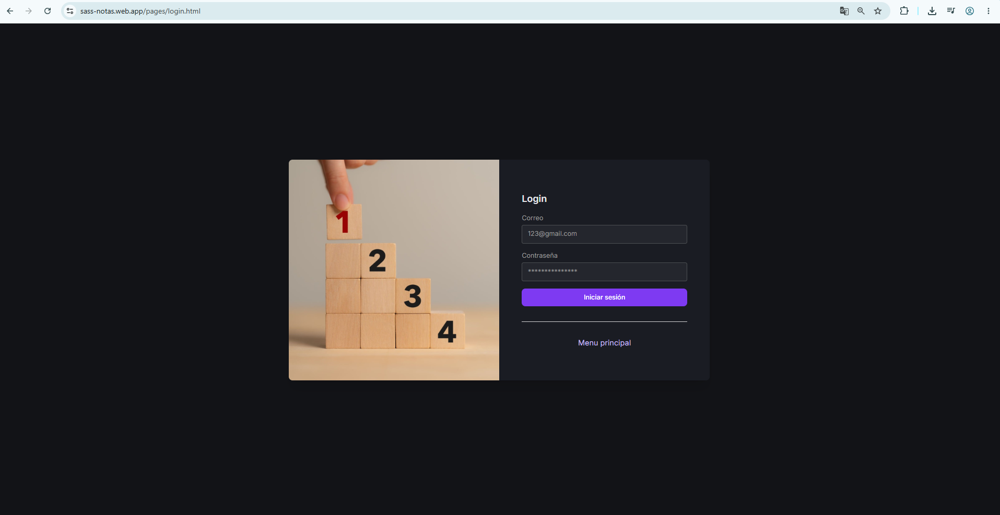
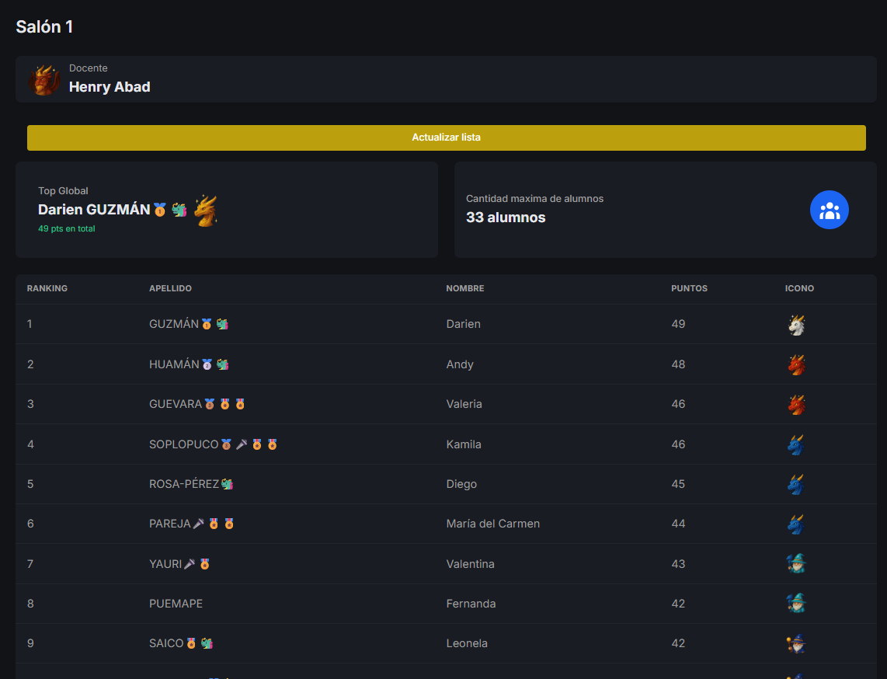
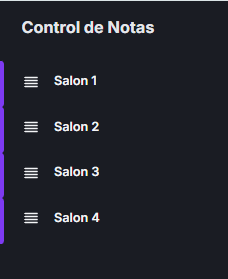

# 📊 Control de Notas — Ranking de Alumnos

Sistema web para la gestión y visualización del ranking de alumnos por salón, pensado para uso docente. Permite iniciar sesión como profesor, seleccionar un salón y consultar el ranking de puntos de los estudiantes en tiempo real.

> ⚠️ **Nota:** Este repositorio no incluye el código fuente del proyecto. Aquí encontrarás la demo en vivo, capturas de pantalla y una descripción funcional del sistema, a modo de muestra de portafolio.

---

## 🔗 Demo en vivo

👉 **[https://sass-notas.web.app/](https://sass-notas.web.app/)**

---

## ✨ Funcionalidades

- 🔐 Inicio de sesión para docentes
- 🏫 Selección entre múltiples salones (Salón 1 a Salón 4)
- 📋 Ranking de alumnos ordenado por puntos
- 🔤 Opción de ordenar por apellido
- 🔄 Actualización dinámica de la lista de alumnos
- 👤 Panel con información del docente activo
- 🎯 Indicador de cantidad máxima de alumnos por salón

---

## 🖼️ Capturas de pantalla

<!-- Reemplaza estas rutas por tus imágenes reales dentro de la carpeta /screenshots -->

| Login | Panel de ranking |
|---|---|
|  |  |

| Selección de salón | Vista docente |
|---|---|
|  |  |

---

## 🛠️ Tecnologías utilizadas

<!-- Ajusta esta lista según tu stack real -->

- HTML5 / CSS3 / JavaScript
- Firebase Hosting
- Firebase (Auth / Firestore o Realtime Database)

---

## 📌 Sobre este repositorio

Este repositorio se mantiene únicamente con fines de presentación (portafolio / proceso de selección). El código fuente completo no está publicado, pero puedo compartir detalles técnicos adicionales o una demo guiada bajo solicitud.

---

## 📬 Contacto

- GitHub: [tu usuario]
- LinkedIn: [tu perfil]
- Email: [tu correo]
